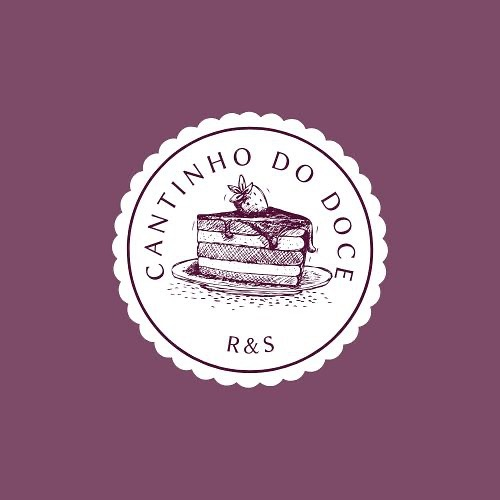

# Cantinho do Doce RS

**Cantinho do Doce RS** -  Esta página foi criada para fornecer uma experiência visual deliciosa aos visitantes e destacar nossos produtos irresistíveis. 

  

## 🚀 Sobre o Projeto

A landing page do Cantinho do Doce foi desenvolvida para oferecer uma interface atraente e intuitiva, onde nossos clientes podem:

- Conhecer nossa história e missão.
- Navegar pelos nossos produtos e especialidades.
- Entrar em contato conosco para pedidos e consultas.

### Funcionalidades

- **Design Responsivo:** Otimizado para todos os dispositivos, garantindo uma experiência de usuário consistente em desktop, tablet e mobile.
- **Galeria de Produtos:** Apresenta nossos doces e bolos com imagens de alta qualidade e descrições detalhadas.
- **Integração com Redes Sociais:** Links para nossas redes sociais para que você possa acompanhar nossas novidades e promoções.

## 🛠️ Tecnologias Utilizadas
- **TailwindCss:** Estilização da pagina.
- **Typescript:** Interatividade e funcionalidades dinâmicas.
- **React.js:** Biblioteca para construção da interface de usuário

## 🌟 Visualização do Projeto

Para visualizar a landing page em ação, você pode acessar a URL ao vivo [aqui](https://cantinho-do-doce-rs.vercel.app/).
